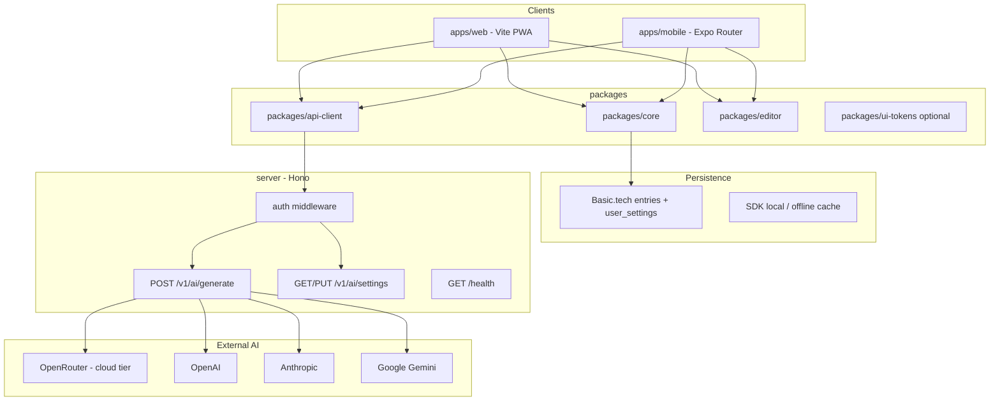
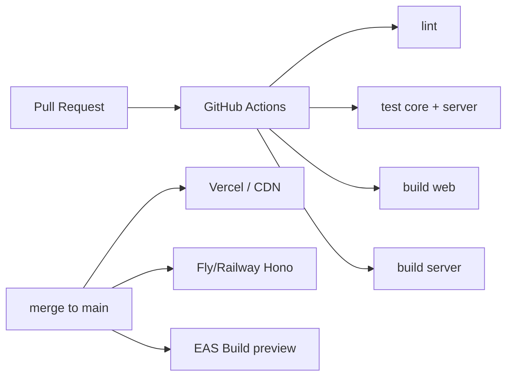
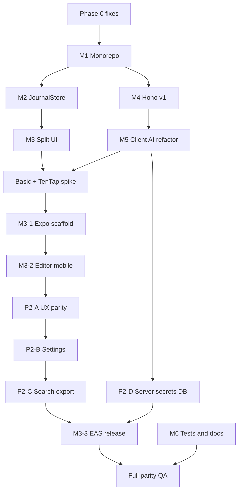

# Arkive Multi-Platform Plan

**Document version:** 1.0  
**Last updated:** 2026-05-27  
**Product:** Arkive ~ Reflective Journal (`arkive` v0.1.1)  
**Scope:** Phase 1 (architecture) + Phase 2 (product & parity) + Phase 3 (Expo mobile). No native desktop app.

---

## Table of contents

1. [Purpose of this document](#purpose-of-this-document)
2. [Executive summary](#executive-summary)
3. [Current state (baseline)](#current-state-baseline)
4. [Known issues to fix first (Phase 0)](#known-issues-to-fix-first-phase-0)
5. [Goals and non-goals](#goals-and-non-goals)
6. [Target architecture](#target-architecture)
7. [Monorepo structure](#monorepo-structure)
8. [Phase 1 — Architecture for growth](#phase-1--architecture-for-growth)
9. [Phase 2 — Product features & full parity](#phase-2--product-features--full-parity)
10. [Phase 3 — Expo mobile app](#phase-3--expo-mobile-app)
11. [Hono API server (detailed design)](#hono-api-server-detailed-design)
12. [Data model & storage](#data-model--storage)
13. [Rich text editor strategy](#rich-text-editor-strategy)
14. [Basic.tech on mobile (spike & ADR)](#basictech-on-mobile-spike--adr)
15. [Feature parity matrix](#feature-parity-matrix)
16. [Environment variables](#environment-variables)
17. [Testing strategy](#testing-strategy)
18. [CI/CD and deployment](#cicd-and-deployment)
19. [Risks and mitigations](#risks-and-mitigations)
20. [Dependency graph & milestones](#dependency-graph--milestones)
21. [Deliverables checklist](#deliverables-checklist)
22. [Appendix: current file map](#appendix-current-file-map)

---

## Purpose of this document

This is the **single source of truth** for evolving Arkive from a web PWA MVP into a **multi-platform product** (web + iOS/Android via Expo) with:

- **Full feature parity** between web and mobile (unless explicitly platform-specific).
- A **unified TypeScript Hono server** for AI and secrets (replacing split Edge + dev proxies).
- A **maintainable monorepo** with shared business logic.

Use this plan for implementation ordering, PR scoping, and architecture decisions (ADRs).

---

## Executive summary

| Layer | Today | Target |
|-------|--------|--------|
| **Clients** | Vite React SPA (PWA) | `apps/web` (PWA) + `apps/mobile` (Expo) |
| **Shared logic** | Inline in components | `packages/core`, `packages/api-client`, `packages/editor` |
| **Persistence** | Basic.tech `entries` collection | Same schema; injectable DB adapter per platform |
| **AI** | Browser (Ollama/BYOK) + Vercel Edge `/api/chat` | Hono `POST /v1/ai/generate`; BYOK keys server-side only |
| **Deploy** | Vercel (static + Edge) | Vercel or CDN for web; Fly/Railway/Render for Hono; EAS for mobile |

**Core principle:** Clients own journal content (TipTap JSON). The server owns API keys, rate limits, provider routing, and encrypted BYOK storage.

---

## Current state (baseline)

### Stack (as of v0.1.1)

| Category | Technology |
|----------|------------|
| UI | React 18, React Router 7, Tailwind CSS 4, Framer Motion |
| Editor | TipTap 3 (StarterKit, Placeholder, custom `AiContentNode`, `SlashCommands`) |
| Sync / auth | `@basictech/react` v0.7.0-beta.6 |
| AI SDK | Vercel AI SDK (`ai`), `@ai-sdk/openai`, `ollama-ai-provider-v2` |
| Build | Vite 5, `vite-plugin-pwa` |
| API (prod) | `api/chat.ts` — Vercel Edge → OpenRouter |
| API (dev) | `server/index.ts` — Hono on port 3001 (duplicate logic) |

### Routes

| Path | Component | Description |
|------|-----------|-------------|
| `/` | `src/pages/Journal.tsx` | Main journal (desktop columns or mobile tabs) |
| `/settings` | `src/pages/Settings.tsx` | AI provider, commands, data tools, PWA install |

### Data schema (`src/basic.config.ts`)

```json
{
  "project_id": "173a6a44-82aa-47d7-ad8d-79a6bed379fd",
  "tables": {
    "entries": {
      "type": "collection",
      "fields": {
        "date": { "type": "string", "indexed": true },
        "content": { "type": "json", "indexed": true }
      }
    }
  }
}
```

**Date key conventions** (`src/pages/Journal.tsx`):

| Granularity | Key format | Example |
|-------------|------------|---------|
| Year | `YYYY` | `2025` |
| Month | `YYYY-MM` | `2025-05` |
| Day | `YYYY-MM-DD` | `2025-05-27` |

### AI providers (`src/lib/ai-config.ts`)

| Provider | ID | Where it runs today |
|----------|-----|---------------------|
| Disabled | `none` | Default |
| Ollama | `ollama` | Browser → user’s `localhost:11434` |
| Bring your own key | `byok` | Browser → OpenAI/Anthropic/Google (keys in `localStorage`) |
| Cloud | `cloud` | Browser → `/api/chat` → OpenRouter |

**Settings storage:** `localStorage` key `journal-ai-settings` (`src/lib/storage.ts`).

### Responsive behavior

- Breakpoint: **768px** (`src/hooks/useIsMobile.ts`).
- **Desktop:** three expandable columns (year / month / day) + `TarotClock` sidebar.
- **Mobile:** bottom tab bar (Year / Month / Day / Home), read-only previews, `MobileDrawer` for editing, `MobileHome` dashboard.

### Build health

- `npm run build` — passes (~1.35 MB JS chunk; avatar asset ~1.7 MB).
- `npm run lint` — 3 warnings (no errors).
- **No automated tests**, **no README**, **no `.env.example`**.

---

## Known issues to fix first (Phase 0)

Complete these **before or in parallel with** monorepo migration. They affect all platforms.

| ID | Issue | Location | Fix |
|----|--------|----------|-----|
| P0-1 | Unauthenticated `/api/chat` | `api/chat.ts` | Auth + rate limit on Hono (Phase 1) |
| P0-2 | Month AI context collision | `Journal.tsx` maps months to names only | Key `monthNotes` by `YYYY-MM` in `journal-context.tsx` |
| P0-3 | Streak counts empty docs | `MobileHome.tsx` ~209 | Require non-whitespace plain text |
| P0-4 | BYOK Anthropic likely broken | `useAI.ts` ~230–235 | Use `@ai-sdk/anthropic` on server, not OpenAI-compat hack |
| P0-5 | AI logs journal text in prod | `useAI.ts` | Gate behind `DEV` only |
| P0-6 | Dead code | `MobileHeader.tsx` | Delete |
| P0-7 | Save/load errors silent | `Journal.tsx` | User-visible toasts |
| P0-8 | Test data duplicates | `Settings.tsx` | Upsert by `date` |
| P0-9 | Large avatar in bundle | `placeholder_avatar.png` | Compress / WebP / separate mobile asset |

---

## Goals and non-goals

### Goals

1. **Monorepo** with shared `packages/core` and typed API client.
2. **Hono server** as the only path for Cloud and BYOK AI (keys never in mobile/web storage).
3. **Expo app** (iOS + Android) with **full feature parity** vs web PWA.
4. **JournalStore** abstraction for load/save/upsert used by both clients.
5. **Search** and **export** on both platforms.
6. **Historical AI context** based on what the user is viewing, not only “today”.
7. Tests on core logic + server; CI for web, server, mobile.

### Non-goals (this plan)

- Native desktop app (Tauri/Electron).
- Replacing Basic.tech (unless mobile spike fails — see ADR).
- Server-side storage of full journal bodies (optional future; clients keep sync via Basic).
- Ollama on mobile (document as web-only unless user provides reachable endpoint).

### Full parity rule

> If a feature exists on one platform, it must ship on the other in the same phase, unless listed as **platform-specific** in the [Feature parity matrix](#feature-parity-matrix).

---

## Target architecture



### Request flow (AI, target state)

1. User triggers slash command in TipTap → `AiContentNode` renders `AiContentCard`.
2. Client builds `journalContext` string via `buildJournalContextString()` from **visible** entries.
3. Client calls `POST /v1/ai/generate` with `commandId`, `userInput`, `tone`, `journalContext`, `provider: 'cloud' | 'byok'`.
4. Hono validates auth, rate limit, payload size.
5. Hono loads BYOK credentials from encrypted store (if `byok`) or uses `OPENROUTER_API_KEY` (if `cloud`).
6. Response `{ text, usage }` rendered in editor card.

**Ollama (web only):** Client calls Ollama directly from browser when `provider === 'ollama'` (no change to server).

---

## Monorepo structure

### Target directory layout

```
arkive/
├── apps/
│   ├── web/                      # Current Vite app (moved from root)
│   │   ├── src/
│   │   ├── index.html
│   │   ├── vite.config.ts
│   │   └── package.json
│   └── mobile/                   # Expo (expo-router)
│       ├── app/                  # File-based routes
│       ├── app.json
│       ├── eas.json
│       └── package.json
├── packages/
│   ├── core/                     # Pure TS: dates, types, context, settings schema, export/search
│   ├── api-client/               # Typed HTTP client for Hono
│   ├── editor/                   # TipTap extensions (web + native splits if needed)
│   └── ui-tokens/                # Optional: colors, fonts, spacing constants
├── server/                       # Hono API (production deploy target)
│   ├── src/
│   │   ├── index.ts
│   │   ├── app.ts
│   │   ├── routes/v1/
│   │   ├── services/ai/
│   │   ├── middleware/
│   │   └── lib/
│   ├── package.json
│   └── Dockerfile                # Optional for Fly/Railway
├── docs/
│   └── MULTI_PLATFORM_PLAN.md    # This file
├── package.json                  # Workspaces root
├── pnpm-workspace.yaml           # or npm workspaces
├── turbo.json                    # Optional Turborepo
└── .env.example
```

### Root scripts (target)

```json
{
  "scripts": {
    "dev": "turbo run dev --parallel",
    "dev:web": "turbo run dev --filter=@arkive/web",
    "dev:mobile": "turbo run dev --filter=@arkive/mobile",
    "dev:server": "turbo run dev --filter=@arkive/server",
    "build": "turbo run build",
    "lint": "turbo run lint",
    "test": "turbo run test"
  }
}
```

### Package naming convention

| Package | Name |
|---------|------|
| Core | `@arkive/core` |
| API client | `@arkive/api-client` |
| Editor | `@arkive/editor` |
| Web app | `@arkive/web` |
| Mobile app | `@arkive/mobile` |
| Server | `@arkive/server` |

---

## Phase 1 — Architecture for growth

**Objective:** Safe to build Expo without duplicating journal or AI logic. Secure AI on the server.

### Milestone M1 — Monorepo migration

| Task | Details |
|------|---------|
| Initialize workspaces | pnpm recommended; move current root app to `apps/web` |
| Create `@arkive/core` | Extract from `Journal.tsx`, `journal-context.tsx`, `ai-config.ts` (types only first) |
| Create `@arkive/api-client` | Stub `health()`, `ai.generate()` |
| Path aliases | `@arkive/core` in web tsconfig |
| CI | Build web + core on every PR |

**Acceptance criteria:**

- [ ] `pnpm build` succeeds for `apps/web` and `packages/core`
- [ ] No user-facing behavior change on web
- [ ] All date helpers live only in `@arkive/core`

**Files to extract first:**

- `formatDayDateKey`, `formatMonthDateKey`, `getMonthName`, `getEntryType`, `getTextFromJSON`
- `buildJournalContextString`, `JournalEntries` interface
- `AISettings`, `Command`, `Tone`, `DEFAULT_SETTINGS`, `DEFAULT_COMMANDS`

---

### Milestone M2 — JournalStore

Replace scattered state in `Journal.tsx` with a store hook.

```typescript
// packages/core — conceptual API
interface JournalStoreState {
  yearNotes: Record<string, JSONContent>
  monthNotes: Record<string, JSONContent>
  dayNotes: Record<string, JSONContent>
  entryIds: Record<string, string>
  isLoading: boolean
  error: string | null
}

interface JournalStoreActions {
  load(db: BasicDB): Promise<void>
  save(date: string, content: JSONContent): Promise<void>
  getPlainTextContext(view: ViewportContext): JournalEntriesForAI
}
```

| Task | Details |
|------|---------|
| Upsert save | Use `entryIds[date]`; handle add vs update |
| Optimistic updates | Update UI immediately; rollback on failure |
| Error surfacing | `error` state → toast in app layer |
| Fix month keys | `monthNotes` for AI uses `YYYY-MM` keys |
| Remove 12-month TODO | Config `MAX_LOADED_MONTHS` (default 24 or unlimited with UX) |

**Acceptance criteria:**

- [ ] `Journal.tsx` (or `JournalScreen`) only orchestrates layout, not persistence
- [ ] Failed save shows user-visible message
- [ ] Unit tests for upsert key logic and `getEntryType`

---

### Milestone M3 — Split UI monoliths

| Source | Target files |
|--------|----------------|
| `Journal.tsx` (~794 lines) | `JournalScreen.tsx`, `JournalDesktopLayout.tsx`, `JournalMobileLayout.tsx`, `EntryPreview.tsx`, `EntryList.tsx` |
| `Settings.tsx` (~793 lines) | `SettingsScreen.tsx`, `AISettingsSection.tsx`, `DataSettingsSection.tsx`, `ProviderCard.tsx` |
| Dead code | Delete `src/components/MobileHeader.tsx` |

**Acceptance criteria:**

- [ ] No component file over ~400 lines
- [ ] Mobile and desktop share `EntryPreview` / list rendering
- [ ] ESLint warnings for `AiContentCard` deps addressed

---

### Milestone M4 — Hono server v1 (AI + auth)

**Consolidate** `api/chat.ts` and `server/index.ts` into `server/`.

#### Server layout

```
server/src/
  index.ts                 # Node serve entry
  app.ts                   # Hono app + global middleware
  routes/v1/
    health.ts
    ai.ts                  # generate + settings
  services/ai/
    index.ts               # provider router
    openrouter.ts
    openai.ts
    anthropic.ts
    google.ts
  services/crypto.ts       # encrypt/decrypt BYOK keys at rest
  middleware/
    auth.ts
    rateLimit.ts
    cors.ts
  lib/
    validation.ts          # Zod schemas
    errors.ts
```

#### API specification

##### `GET /health`

```json
{ "status": "ok", "version": "1.0.0" }
```

##### `POST /v1/ai/generate`

**Headers:** `Authorization: Bearer <basic_session_token>`  
**Body:**

```typescript
{
  commandId: string
  userInput?: string
  tone: 'mystical' | 'direct' | 'gentle' | 'analytical'
  // Either send full command metadata or let server resolve by commandId
  systemPrompt: string
  journalContext: string
  provider: 'cloud' | 'byok'
  // Optional overrides when provider is byok (model id only, never keys)
  model?: string
}
```

**Response:**

```typescript
{
  text: string
  usage?: {
    promptTokens: number
    completionTokens: number
    totalTokens: number
  }
}
```

**Errors:** `401` unauthorized, `429` rate limited, `400` validation, `502` provider failure

##### `GET /v1/ai/settings`

Returns non-secret preferences: `provider`, `tone`, `commands`, `byokProvider`, `byokModel` (not API key).

##### `PUT /v1/ai/settings`

```typescript
{
  provider: 'cloud' | 'byok' | 'none'
  tone: Tone
  commands: Command[]
  byokProvider?: BYOKProvider
  byokModel?: string
  byokApiKey?: string   // write-only; stored encrypted server-side
}
```

#### Middleware

| Middleware | Behavior |
|------------|----------|
| CORS | Allow production web origin + Expo dev origins (`exp://`, `http://localhost:8081`) |
| Auth | Validate Basic session JWT (confirm mechanism with Basic.tech docs) |
| Rate limit | Per-user: e.g. 30 req/min cloud; configurable |
| Validation | Max body size; `journalContext` + `userInput` length caps |
| Logging | Never log full `journalContext` in production |

#### Provider routing

| Provider | Implementation |
|----------|----------------|
| `cloud` | OpenRouter (`OPENROUTER_API_KEY`, `OPENROUTER_MODEL`) — migrate from `api/chat.ts` |
| `byok` + `openai` | `@ai-sdk/openai` with user key from DB |
| `byok` + `anthropic` | `@ai-sdk/anthropic` (fix P0-4) |
| `byok` + `google` | `@ai-sdk/google` or official Gemini SDK |

#### Deployment

| Environment | Web API URL | Server |
|-------------|-------------|--------|
| Local | Vite proxy `/api` → `http://localhost:3001` | `pnpm dev:server` |
| Production | `https://api.<domain>/v1/...` | Fly.io / Railway / Render |

**Retire:** `api/chat.ts` after cutover (or thin Vercel rewrite proxy during transition).

**Acceptance criteria:**

- [ ] Cloud and BYOK from web hit Hono only
- [ ] Unauthenticated requests return 401
- [ ] Rate limit returns 429
- [ ] No API keys in `localStorage` for BYOK
- [ ] Integration test with mocked OpenRouter

---

### Milestone M5 — Client AI refactor

| Task | Details |
|------|---------|
| Slim `useAI` | Build prompts locally; delegate to `@arkive/api-client` |
| Settings UI | BYOK key field saves via `PUT /v1/ai/settings` |
| Remove | `generateWithBYOK`, `generateWithCloud` from browser |
| Ollama | Remain client-only in `apps/web`; hide on mobile |
| SlashCommands | Read provider from settings; if `cloud`/`byok`, require signed-in for AI |

**Acceptance criteria:**

- [ ] `useAI.ts` under ~150 lines in web app (logic in api-client + core)
- [ ] No production console logging of journal text

---

### Milestone M6 — Tests & documentation

| Area | Coverage |
|------|----------|
| `@arkive/core` | Date keys, entry type, context builder, settings deep-merge |
| `@arkive/server` | Validation, auth middleware, AI router mocks |
| Docs | Root README, `docs/ENV.md`, `.env.example` |

**Acceptance criteria:**

- [ ] `pnpm test` runs in CI
- [ ] New contributor can run web + server from README

---

## Phase 2 — Product features & full parity

**Objective:** Same capabilities on web and Expo; polish MVP gaps.

### Milestone P2-A — Journal UX parity

| Task | Web | Mobile |
|------|-----|--------|
| Home dashboard | Add `/home` (or tab) with sun, streak, quotes | Keep `(tabs)/index` |
| Tarot clock | Available on Home or journal header | Same widget component from shared package |
| Drawer placeholders | N/A | Dynamic by entry type (year/month/day) |
| Scroll-to-top | Desktop day column | Mobile day tab |
| Historical AI context | Fix `buildJournalContextString` to accept viewport | Same shared function |

**Viewport context (new type in `@arkive/core`):**

```typescript
interface ViewportContext {
  year: number
  monthIndex: number          // 0-11
  monthKey: string          // YYYY-MM
  visibleDayKeys: string[]  // days in scroll viewport
}
```

**Acceptance criteria:**

- [ ] AI context includes entries for the period user is viewing
- [ ] Web has Home features matching `MobileHome.tsx`
- [ ] Streak uses non-empty text only (P0-3)

---

### Milestone P2-B — Settings & data

| Task | Details |
|------|---------|
| Replace `alert`/`confirm` | Accessible modal components |
| Responsive provider grid | `grid-cols-2` sm, `grid-cols-4` lg |
| Sync preferences | New Basic collection `user_settings` OR server `GET/PUT` for commands/tone |
| Test data load | Upsert by `date`; idempotent |
| Clear data | Split: “clear local cache” vs “delete account entries” |

**Optional Basic schema extension:**

```json
"user_settings": {
  "type": "collection",
  "fields": {
    "userId": { "type": "string", "indexed": true },
    "aiSettings": { "type": "json" }
  }
}
```

(Exclude API keys from synced JSON — keys only on Hono.)

---

### Milestone P2-C — Search & export

#### Search

- Build plain-text index in `@arkive/core` from `getTextFromJSON`
- Web: ⌘K command palette or header search
- Mobile: search icon → full-screen sheet

```typescript
searchEntries(entries, query): SearchResult[]
// { date, type, snippet, score }
```

#### Export

```typescript
exportJournal(entries): { json: string; markdown: string }
```

- Web: `download` attribute / File API
- Mobile: `expo-file-system` + `expo-sharing`

**Acceptance criteria:**

- [ ] Search works across year/month/day on both platforms
- [ ] Export produces valid JSON and readable Markdown

---

### Milestone P2-D — Server settings & encryption

| Task | Details |
|------|---------|
| Encrypt BYOK keys | AES-256-GCM with `ENCRYPTION_KEY` env |
| Database | Postgres (Fly) or Supabase — `user_ai_secrets` table |
| Revoke keys | `DELETE /v1/ai/settings/keys` |

**Table sketch:**

```sql
CREATE TABLE user_ai_secrets (
  user_id TEXT PRIMARY KEY,
  byok_provider TEXT,
  encrypted_api_key BYTEA,
  byok_model TEXT,
  updated_at TIMESTAMPTZ
);
```

---

## Phase 3 — Expo mobile app

**Objective:** Production iOS/Android builds with shared core.

### Milestone M3-1 — Expo scaffold

| Choice | Decision |
|--------|----------|
| Framework | Expo SDK 52+ (track latest stable) |
| Navigation | Expo Router (file-based) |
| Styling | NativeWind v4 (share tokens with web) |
| Auth | `expo-auth-session` if Basic requires browser OAuth |
| Secrets | `expo-secure-store` for session token only |

#### Route map

| Expo route | Web equivalent |
|------------|----------------|
| `app/(tabs)/index.tsx` | `/home` |
| `app/(tabs)/journal/year.tsx` | `/` mobile year tab |
| `app/(tabs)/journal/month.tsx` | `/` mobile month tab |
| `app/(tabs)/journal/day.tsx` | `/` mobile day tab |
| `app/(tabs)/settings.tsx` | `/settings` |
| `app/profile.tsx` | Profile popover (modal/sheet) |

#### Dependencies (mobile-specific)

```
expo
expo-router
expo-secure-store
expo-file-system
expo-sharing
react-native
@10play/tentap-editor   # TipTap on RN — validate in spike
nativewind
@arkive/core
@arkive/api-client
@arkive/editor
```

**Acceptance criteria:**

- [ ] App boots on iOS simulator and Android emulator
- [ ] Points at staging Hono API
- [ ] Uses `JournalStore` from `@arkive/core`

---

### Milestone M3-2 — Editor & AI on device

See [Rich text editor strategy](#rich-text-editor-strategy).

**Acceptance criteria:**

- [ ] Slash commands work on mobile keyboard
- [ ] `AiContentCard` equivalent renders streaming or loading state
- [ ] Saves use same debounce policy as web (3s + blur)

---

### Milestone M3-3 — EAS build & release

| Profile | Use |
|---------|-----|
| `development` | Dev client, internal |
| `preview` | TestFlight / internal APK |
| `production` | App Store / Play Store |

**app.json highlights:**

- `scheme`: `arkive`
- Proper `icon`, `splash`, `ios.bundleIdentifier`, `android.package`
- `EXPO_PUBLIC_API_URL` via `eas.json` env

**Acceptance criteria:**

- [ ] TestFlight build installs and syncs journal
- [ ] Production env uses production Hono + Basic project

---

### Milestone M3-4 — Full parity QA

Run the [Deliverables checklist](#deliverables-checklist) on physical devices.

---

## Hono API server (detailed design)

### Why Hono (not Vercel Edge only)

| Requirement | Hono on Node/Bun |
|-------------|------------------|
| Encrypted BYOK storage | Needs DB + stable encryption |
| Same API for web + Expo | Single base URL |
| Rate limiting | Redis or in-memory store |
| Provider SDK parity | Full Node AI SDK support |
| Local dev | Already used in `server/index.ts` |

Edge can remain for **static web hosting** only.

### Auth integration (Basic.tech)

**Action item (spike):** Confirm how to validate a Basic session token server-side.

Options:

1. Basic provides JWT — Hono verifies signature with public key / shared secret.
2. Hono calls Basic introspection endpoint with token.
3. Short-lived tokens issued by a future Arkive auth wrapper.

Until confirmed, implement `auth` middleware as a pluggable interface:

```typescript
interface AuthService {
  verify(token: string): Promise<{ userId: string } | null>
}
```

### Rate limiting

| Tier | Limit (example) |
|------|-----------------|
| Cloud (authenticated) | 30 requests / minute / user |
| Anonymous | Blocked (401) |

Use `@hono-rate-limiter` or Upstash Redis for production.

### Migration from current code

| Current file | Action |
|--------------|--------|
| `api/chat.ts` | Port to `server/src/services/ai/openrouter.ts`; delete after cutover |
| `server/index.ts` | Replace with `server/src/index.ts` + modular routes |
| `src/hooks/useAI.ts` | Keep Ollama branch only (web); cloud/BYOK → api-client |
| `vite.config.ts` proxy | Point to `@arkive/server` port |

---

## Data model & storage

### Entries (unchanged)

Continue using Basic.tech `entries` collection. Both clients use the same date key formats.

### New: user settings (Phase 2)

Sync **non-secret** AI preferences across devices:

| Field | Stored where |
|-------|----------------|
| `provider`, `tone`, `commands` | Basic `user_settings` or Hono DB |
| `byokApiKey` | Hono encrypted table only |
| `ollamaEndpoint`, `ollamaModel` | Web `localStorage` only |

### Journal context for AI

```typescript
// packages/core/buildJournalContext.ts
function buildJournalContextString(
  entries: JournalEntries,
  viewport: ViewportContext
): string
```

Include:

- Year entry for `viewport.year`
- Month entry for `viewport.monthKey`
- Day entries in `viewport.visibleDayKeys` (or current month up to viewed day)

---

## Rich text editor strategy

TipTap is DOM-based. Mobile requires a deliberate approach.

### Options evaluated

| Option | Pros | Cons |
|--------|------|------|
| **TenTap** (`@10play/tentap-editor`) | TipTap on RN; best parity path | Custom nodes may need extra work |
| **WebView + bundled editor** | Reuse exact web TipTap | Heavier; keyboard/focus quirks |
| **Native TextInput** | Simple | **Rejected** — no parity |

### Recommended path

1. **Spike (2–3 days):** TenTap + custom `aiContent` node + slash menu on iOS.
2. If spike fails: WebView hosting minimal editor bundle from `apps/web` (fallback).
3. Package structure:

```
packages/editor/
  src/
    extensions/
      AiContentNode.ts      # shared schema
      SlashCommands.ts      # shared command defs
    web/                    # @tiptap/react bindings
    native/                 # TenTap bindings
```

### Save behavior (both platforms)

From `TiptapEditor.tsx`:

- Debounced save every **3 seconds**
- Flush on **blur**
- Flush on **unmount**

Implement in `@arkive/editor` hook `useEditorPersistence({ onChange })`.

---

## Basic.tech on mobile (spike & ADR)

**Risk:** `@basictech/react` may be web-oriented (React DOM, IndexedDB).

### Spike tasks (required before M3-1)

| # | Task | Output |
|---|------|--------|
| 1 | Run Basic sign-in in Expo WebView | Pass/fail |
| 2 | Check for React Native SDK or REST API docs | Link in ADR |
| 3 | Prototype `JournalStore.load/save` on device | Sync one entry |

### ADR outcomes

| Decision | If… |
|----------|-----|
| **A. Use Basic RN SDK** | SDK exists and supports `entries` collection |
| **B. REST adapter** | HTTP API documented for entries CRUD |
| **C. WebView auth shell** | Temporary — only for beta |
| **D. Custom sync** | Last resort — out of scope for v1 |

**Store interface (platform-agnostic):**

```typescript
interface JournalDB {
  getAllEntries(): Promise<JournalEntry[]>
  upsertEntry(date: string, content: JSONContent, id?: string): Promise<{ id: string }>
}
```

Web: Basic SDK adapter. Mobile: TBD from spike.

---

## Feature parity matrix

| Feature | Web today | Web target | Mobile target | Platform-specific? |
|---------|-----------|------------|---------------|-------------------|
| Year entries | ✓ columns | ✓ | ✓ tab + drawer | No |
| Month entries | ✓ | ✓ | ✓ | No |
| Day entries | ✓ | ✓ | ✓ | No |
| Inline edit | ✓ | ✓ | drawer | Interaction differs, capability same |
| TipTap rich text | ✓ | ✓ | ✓ TenTap | No |
| Slash AI commands | ✓ | ✓ | ✓ | No |
| AI content cards | ✓ | ✓ | ✓ | No |
| AI provider: none | ✓ | ✓ | ✓ | No |
| AI provider: cloud | ✓ | ✓ via Hono | ✓ via Hono | No |
| AI provider: BYOK | ✓ | ✓ via Hono | ✓ via Hono | No |
| AI provider: Ollama | ✓ | ✓ | Hidden / message | **Yes** — web only |
| Settings | ✓ | ✓ responsive | ✓ | No |
| Auth sign-in/out | ✓ | ✓ | ✓ | No |
| Profile / About | ✓ | ✓ | ✓ sheet | UI differs |
| PWA install | ✓ | ✓ | N/A | **Yes** |
| App Store install | N/A | N/A | ✓ EAS | **Yes** |
| Tarot clock | sidebar | Home/header | Home/header | No |
| Sun / streak / quotes | mobile only | ✓ Home | ✓ Home | No |
| Infinite day scroll | 12 mo cap | configurable | same | No |
| Scroll-to-top | desktop | both | both | No |
| Search | ✗ | ✓ | ✓ | No |
| Export JSON/MD | ✗ | ✓ | ✓ share sheet | Delivery differs |
| Offline write | PWA + Basic | ✓ | ✓ | No |
| Error toasts | ✗ | ✓ | ✓ | No |
| Test data | ✓ | ✓ upsert | ✓ | No |
| Clear local data | ✓ | ✓ scoped | ✓ | No |

---

## Environment variables

### `.env.example` (root)

```bash
# --- Server (@arkive/server) ---
PORT=3001
OPENROUTER_API_KEY=
OPENROUTER_MODEL=anthropic/claude-3.5-haiku
ENCRYPTION_KEY=                    # 32-byte hex for BYOK encryption
DATABASE_URL=                      # Postgres for user_ai_secrets
CORS_ORIGINS=http://localhost:5173,http://localhost:8081
BASIC_AUTH_VERIFY_URL=             # TBD from Basic.tech spike

# --- Web (apps/web) ---
VITE_API_URL=http://localhost:3001
VITE_BASIC_PROJECT_ID=173a6a44-82aa-47d7-ad8d-79a6bed379fd

# --- Mobile (apps/mobile) ---
EXPO_PUBLIC_API_URL=http://localhost:3001
EXPO_PUBLIC_BASIC_PROJECT_ID=173a6a44-82aa-47d7-ad8d-79a6bed379fd
```

### Production

| Var | Where |
|-----|--------|
| `OPENROUTER_API_KEY` | Server only |
| `ENCRYPTION_KEY` | Server only |
| `VITE_API_URL` | Web build-time |
| `EXPO_PUBLIC_API_URL` | EAS build profiles |

**Never** expose `OPENROUTER_API_KEY` or user BYOK keys to clients.

---

## Testing strategy

| Layer | Tool | What to test |
|-------|------|----------------|
| `@arkive/core` | Vitest | Dates, entry types, context builder, search, export |
| `@arkive/server` | Vitest + supertest | Routes, validation, auth, AI mocks |
| `apps/web` | Vitest + Playwright (later) | Smoke: load journal, save entry |
| `apps/mobile` | Jest + Maestro (later) | Smoke: open drawer, save |
| Manual | TestFlight / internal APK | Full parity checklist |

### Example core tests

```typescript
describe('getEntryType', () => {
  it('parses year', () => expect(getEntryType('2025')).toBe('year'))
  it('parses month', () => expect(getEntryType('2025-05')).toBe('month'))
  it('parses day', () => expect(getEntryType('2025-05-27')).toBe('day'))
})

describe('buildJournalContextString', () => {
  it('uses YYYY-MM month keys without collision')
})
```

---

## CI/CD and deployment



| Artifact | Platform | Trigger |
|----------|----------|---------|
| Web `dist/` | Vercel | Push to `main` |
| Hono Docker | Fly.io | Push to `main` |
| iOS/Android | EAS | Tag or manual `production` |

---

## Risks and mitigations

| Risk | Impact | Mitigation |
|------|--------|------------|
| Basic.tech no native SDK | Blocks mobile sync | Week-0 spike; `JournalDB` adapter; ADR |
| TenTap不支持 `aiContent` | AI in editor broken on mobile | WebView fallback editor |
| Scope creep | Delays launch | Parity matrix is scope contract |
| OpenRouter cost abuse | Financial | Auth + rate limit on Hono |
| Large web bundle | Slow PWA | Code split, compress avatar |
| npm audit vulnerabilities | Security | `npm audit` in CI; upgrade path |
| Hardcoded `project_id` | Wrong env deploys | Env-based config per environment |

---

## Dependency graph & milestones



### Suggested implementation order

| Order | Milestone | Notes |
|-------|-----------|-------|
| 1 | P0 | Quick wins; security |
| 2 | M1 + M4 | Foundation + Hono in parallel |
| 3 | M2 + M5 | Store + client uses API |
| 4 | M3 + M6 | Refactor + tests |
| 5 | SPIKE | Basic + TenTap — gate for mobile |
| 6 | P2-A/B/C/D | Product parity |
| 7 | M3-* | Expo build |
| 8 | QA | Ship checklist |

---

## Deliverables checklist

### Phase 1 complete when:

- [ ] Monorepo: `apps/web`, `packages/core`, `packages/api-client`, `server`
- [ ] `JournalStore` with tests
- [ ] Hono: `/v1/ai/generate`, auth, rate limit
- [ ] Web cloud/BYOK via Hono only
- [ ] No `api/chat.ts` duplicate
- [ ] README + `.env.example`

### Phase 2 complete when:

- [ ] Feature parity matrix: all “target” columns checked
- [ ] Search + export on web and mobile
- [ ] Web Home matches mobile dashboard widgets
- [ ] BYOK encrypted server-side
- [ ] Settings: no `alert()`; responsive layout

### Phase 3 complete when:

- [ ] Expo app on TestFlight and internal Android track
- [ ] EAS production profile configured
- [ ] Physical device QA passed
- [ ] Ollama documented as web-only

### Project complete when:

- [ ] All above + observability (Sentry recommended)
- [ ] CI green on all packages
- [ ] This document updated with ADR links and actual API URLs

---

## Appendix: current file map

### Application source (`src/`)

| Path | Role |
|------|------|
| `main.tsx` | React entry, `BasicProvider` |
| `App.tsx` | Routes: `/`, `/settings` |
| `basic.config.ts` | Basic project ID + schema |
| `pages/Journal.tsx` | Main journal UI (desktop + mobile) |
| `pages/Settings.tsx` | AI + data settings |
| `hooks/useIsMobile.ts` | 768px breakpoint |
| `hooks/useAI.ts` | AI generation routing |
| `lib/storage.ts` | AI settings localStorage |
| `lib/ai-config.ts` | Types, defaults, commands |
| `lib/journal-context.tsx` | AI context React context |
| `components/TiptapEditor.tsx` | TipTap wrapper |
| `components/AiContentCard.tsx` | AI result UI in editor |
| `components/MobileTabBar.tsx` | Mobile navigation |
| `components/MobileDrawer.tsx` | Mobile editor sheet |
| `components/MobileHome.tsx` | Dashboard (streak, sun, quotes) |
| `components/MobileHeader.tsx` | **Unused — delete** |
| `components/TarotClock.tsx` | Desktop clock sidebar |
| `components/UserProfilePopover.tsx` | Auth + settings link |
| `extensions/SlashCommands.tsx` | `/` menu |
| `extensions/AiContentNode.ts` | Custom TipTap node |
| `data/placeholder/*.json` | Demo content for Settings |

### API / server

| Path | Role |
|------|------|
| `api/chat.ts` | Vercel Edge OpenRouter proxy (to replace) |
| `server/index.ts` | Dev Hono proxy (to replace) |

### Config / build

| Path | Role |
|------|------|
| `vite.config.ts` | Vite + PWA + `/api` proxy |
| `vercel.json` | Static deploy config |
| `package.json` | Dependencies v0.1.1 |
| `eslint.config.js` | Lint rules |

### Related documents (to create during implementation)

| Document | Purpose |
|----------|---------|
| `docs/ADR-001-basic-mobile.md` | Basic.tech mobile auth/sync decision |
| `docs/ADR-002-editor-native.md` | TenTap vs WebView decision |
| `docs/ENV.md` | Expanded env var documentation |
| `docs/API.md` | OpenAPI or route reference for Hono |

---

## Revision history

| Version | Date | Changes |
|---------|------|---------|
| 1.0 | 2026-05-27 | Initial comprehensive plan |

---

*End of document*
